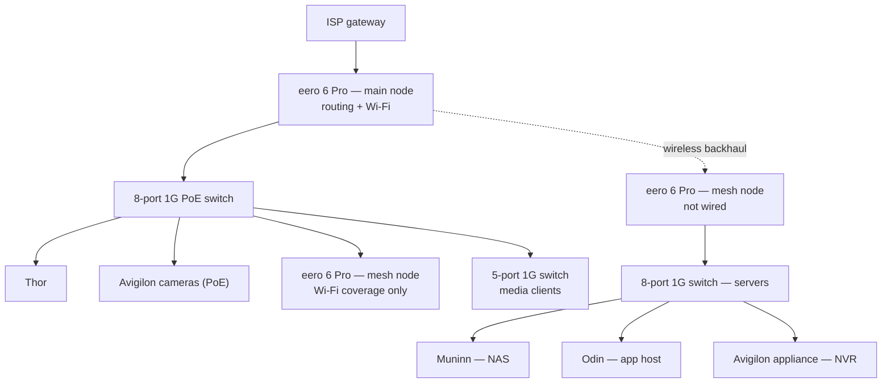
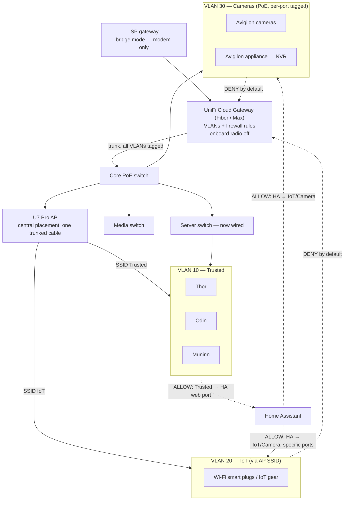

# Network

The physical network as it stands, and the planned move to a segmented UniFi layout. [ADR 007](./decisions/007-no-network-upgrade.md) records why the network was left alone until now; the arrival of cameras is the trigger it named for revisiting that.

## Constraints

- **Bandwidth.** A 3 Gbps fibre plan, capped at 1 Gbps by the eero's ports and every switch downstream of it.
- **Geography.** The fibre lands at one edge of the house, not centrally. The gateway has to live there; nothing else does.
- **Coverage.** A single access point at the fibre location has never covered the whole house. That is why a mesh exists at all.
- **Goal.** Real VLAN segmentation, with cameras and IoT isolated from trusted traffic, and the multi-gig WAN unlocked.
- **Home Assistant** has to reach devices on the IoT and camera segments *and* be reachable from phones and Odin on the trusted one. That is a firewall-rule problem (narrow allows in each direction), not a reason for a shared flat VLAN.

## Current state

**What's wrong with it:**

- **No VLANs anywhere.** Neither the ISP gateway nor the eeros can segment traffic, so everything, cameras included, shares one flat network.
- **No per-SSID VLAN mapping.** Even where eero supports tagging, an "IoT" SSID can't be put on its own VLAN.
- **The servers hang off a wireless hop.** Muninn, Odin and the NVR reach the rest of the network through a wirelessly backhauled mesh node. That is a throughput bottleneck and a fragility point for the machines that matter most.
- **1 Gbps ceiling end to end**, on a 3 Gbps plan.

## Planned state — UniFi, gateway and AP separated

The principle: **the gateway (routing, firewall, VLANs) lives where the fibre lands, which is fixed. The access points don't have to.** A single Ethernet run can carry every VLAN as an 802.1Q trunk, and the APs and switches tag or untag per SSID or per port.

**Hardware shape:**

- **One dedicated gateway**, Cloud Gateway Fiber or Max class, for multi-gig WAN, VLAN routing and firewall.
- **One dedicated AP (U7 Pro) to start**, centrally placed and fed by a trunk, rather than a combo unit that welds the AP to the gateway's location.
- **A second, smaller AP only if walk-testing says so.** If the single U7 Pro can't cover both ends of the house once placed, add a U6/U7-Lite class unit for that zone. Measure first rather than overbuy.
- **Keep the existing PoE switch for cameras** if it supports VLAN tagging; otherwise swap it for a managed PoE unit.
- **Other switches move to 2.5G opportunistically.** Only Thor has a 2.5G NIC today, so there's no day-one reason to replace them all.

**Rejected approaches:**

- **Keep the eeros as Wi-Fi-only nodes behind a UniFi gateway.** Bridge mode works, but eero has no per-SSID VLAN mapping, so all Wi-Fi traffic lands on one flat network whatever the wired side does. That defeats segmentation for any Wi-Fi-only IoT device.
- **UX7 / UDR7 as the only device.** Fine only if one AP at the gateway's fixed location covers the house, and here it doesn't. Using one would recreate today's coverage problem on better hardware.
- **UCG-Ultra as the gateway.** Its 2.5G WAN port caps below the 3 Gbps plan.

## Open items

- [ ] Confirm the existing 8-port PoE switch is managed and supports VLAN tagging, or budget for a managed replacement.
- [ ] Run Ethernet to the server switch before retiring the mesh's wireless backhaul.
- [ ] Walk-test a single U7 Pro before deciding on a second AP.
- [ ] Choose the gateway (Cloud Gateway Fiber vs Max) on price and feature difference.
