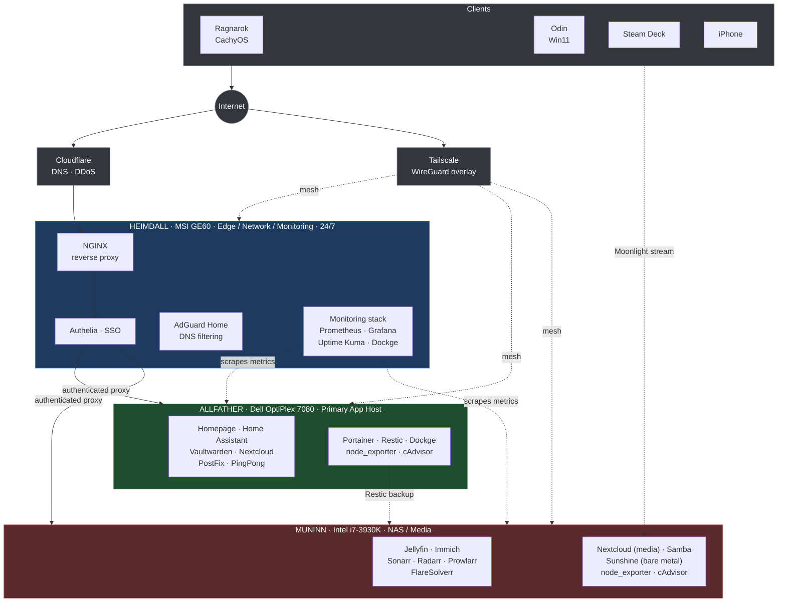

# 🏠 Homelab

A three-node home infrastructure built around clear separation of responsibilities — network edge, application hosting, and media/storage are intentionally isolated so that any single node can go down without taking the rest of the stack with it.

> **Companion docs:** [`SERVICES.md`](./SERVICES.md) is a flat reference of every service and where it runs. [`decisions/`](./decisions) holds the Architecture Decision Records — the *why* behind the choices below.

---

## Architecture Overview

```
Internet
    │
    ├── Cloudflare (DNS + DDoS)
    │
    └── Tailscale (overlay network — remote access)
            │
    ┌───────▼────────┐
    │   HEIMDALL     │  ← Network edge. Always on. If this goes down, nothing else matters.
    │   (GE60)       │     AdGuard · NGINX · Authelia · Grafana · Prometheus · Uptime Kuma
    └───────┬────────┘
            │ reverse proxy (authenticated)
    ┌───────▼────────┐        ┌──────────────────┐
    │   ALLFATHER    │        │     MUNINN        │
    │  (Dell 7080)   │        │    (i7-3930K)     │
    │                │        │                   │
    │ Home Assistant │        │ Jellyfin · Immich │
    │ Vaultwarden    │        │ Sonarr · Radarr   │
    │ Nextcloud      │        │ Prowlarr          │
    │ PostFix        │        │ Nextcloud (media) │
    │ PingPong       │        │ Samba             │
    │ Homepage       │        │ Moonlight/Sunshine│
    └────────────────┘        └──────────────────┘
```


<details>
<summary>Diagram as Mermaid source (renders natively on GitHub)</summary>


</details>

The key architectural principle: **Heimdall is the only node that faces the network.** All service traffic routes through it. Allfather and Muninn are unreachable directly from outside — Tailscale or the reverse proxy are the only entry points.

---

## The Nodes

### Heimdall — Network Edge & Monitoring
*MSI GE60 (2OE) · Running 24/7*

The most critical node. Handles all DNS, routing, authentication, and observability. Deliberately kept lean — if a service doesn't belong to "traffic direction" or "observation," it doesn't run here.

| Service | Role |
|---|---|
| AdGuard Home | Network-wide DNS ad/tracker blocking |
| NGINX | Reverse proxy — routes `*.portalgun.dev` subdomains |
| Authelia | SSO authentication layer in front of NGINX |
| Tailscale | Overlay network for secure remote access |
| Grafana | Metrics dashboards |
| Prometheus | Metrics collection (scrapes all nodes) |
| Uptime Kuma | Service availability monitoring |
| Dockge | Docker Compose management UI |
| cAdvisor + node_exporter | Container and host metrics |

**Design decision:** Monitoring lives on the edge node intentionally. If Allfather or Muninn goes down, that's exactly when you need visibility. Monitoring on the failing node is useless. → [ADR 001](./decisions/001-monitoring-on-edge-node.md)

---

### Allfather — Primary Application Host
*Dell OptiPlex 7080 · Primary compute node*

Runs the services that matter most day-to-day. Sized to handle the workloads that actually need CPU — Nextcloud, Home Assistant automations, and application logic.

| Service | Role |
|---|---|
| Homepage | Unified homelab dashboard |
| Home Assistant | Home automation |
| Vaultwarden | Self-hosted Bitwarden password manager |
| Nextcloud | Self-hosted file sync and cloud storage |
| PostFix | Mail relay |
| PingPong | Machine-to-machine messaging (personal project) |
| Portainer | Container management |
| Restic | Automated backups |
| Dockge | Docker Compose management UI |

---

### Muninn — NAS & Media
*Intel i7-3930K · Storage and media workloads*

The oldest machine in the stack, repurposed as a dedicated storage and media node. The 3930K's age doesn't matter for this role — media serving and file storage are I/O-bound, not CPU-bound.

| Service | Role |
|---|---|
| Jellyfin | Self-hosted media server |
| Immich | Self-hosted photo management (Google Photos replacement) |
| Sonarr / Radarr | TV and movie library management |
| Prowlarr | Indexer aggregator |
| FlareSolverr | Cloudflare bypass for indexers |
| Samba | LAN file sharing |
| Nextcloud (media) | Media library accessible via Nextcloud |
| Moonlight / Sunshine | GPU game streaming (bare metal) |

**Design decision:** Moonlight/Sunshine runs bare metal rather than in Docker. GPU passthrough adds complexity with no real benefit in this context — direct hardware access is simpler and more performant for game streaming. → [ADR 003](./decisions/003-moonlight-bare-metal.md)

---

## Network & Security

**External traffic:** Cloudflare sits in front of the public domain. All traffic terminates at NGINX on Heimdall. Authelia enforces authentication before any service is reachable. → [ADR 002](./decisions/002-authelia-at-boundary.md)

**Remote access:** Tailscale provides a zero-config WireGuard overlay network. Internal services are reachable over Tailscale without any port forwarding on the router.

**Internal traffic:** AdGuard handles DNS for the local network and resolves internal subdomains locally (no hairpin NAT). All inter-node communication stays on the LAN.

**No direct port forwarding** to Allfather or Muninn. Both nodes are only reachable via the reverse proxy (authenticated) or Tailscale. → [ADR 004](./decisions/004-no-direct-port-forwarding.md)

---

## Observability Stack

All three nodes export metrics to Prometheus running on Heimdall via `node_exporter` (host metrics) and `cAdvisor` (container metrics). Grafana dashboards provide a unified view across the stack. Uptime Kuma monitors availability of each service endpoint.

This means monitoring survives compute node failures — the most useful property a monitoring stack can have.

---

## Design Principles

**Separation of responsibilities.** Network edge, application hosting, and storage/media are on separate hardware. A node going down affects only its own services.

**Monitoring on the edge.** Observability infrastructure lives on the most stable node, not with the services it monitors.

**Auth at the boundary.** Authelia handles SSO for all externally-accessible services at the reverse proxy layer. Services themselves don't need to implement authentication individually.

**Boring infrastructure.** Docker Compose over Kubernetes. Tailscale over self-managed WireGuard. The goal is services that run quietly, not an infrastructure playground. → [ADR 005](./decisions/005-docker-compose-over-kubernetes.md)

**3-2-1 backup strategy.** Restic on Allfather handles automated backups. Two local copies (Allfather + Muninn) and one offsite.

---

## Repository Layout

```
.
├── README.md          # This file — architecture overview
├── SERVICES.md        # Flat reference: every service, its port, and its node
├── LICENSE            # MIT
├── assets/
│   ├── architecture.png   # Rendered architecture diagram
│   └── diagram.mmd        # Mermaid source for the diagram
└── decisions/         # Architecture Decision Records (ADRs)
    ├── README.md
    ├── 001-monitoring-on-edge-node.md
    ├── 002-authelia-at-boundary.md
    ├── 003-moonlight-bare-metal.md
    ├── 004-no-direct-port-forwarding.md
    └── 005-docker-compose-over-kubernetes.md
```

---

## What's Not Here

Config files are intentionally excluded — they contain environment-specific values and secrets even when scrubbed. This repo documents architecture and decisions, not deployment specifics.

---

## Hardware

| Node | Machine | CPU | RAM | Role |
|---|---|---|---|---|
| Heimdall | MSI GE60 (2OE) | Intel Core i7-4700MQ (4th gen, Haswell) | 8GB | Edge / Monitoring |
| Allfather | Dell OptiPlex 7080 | Intel Core i7-10700 (10th gen, Comet Lake) | 32GB | Applications |
| Muninn | Custom | Intel i7-3930K | 32GB | NAS / Media |

---

## Devices

| Device | OS | Notes |
|---|---|---|
| Ragnarok (desktop) | CachyOS / Hyprland | AMD Ryzen 9 9950X3D · RTX 5080 · daily driver |
| Odin (laptop) | Windows 11 | Gaming / Windows workloads |
| Steam Deck | SteamOS | Portable gaming · Moonlight client |
| iPhone | iOS | Mobile · Tailscale client |
